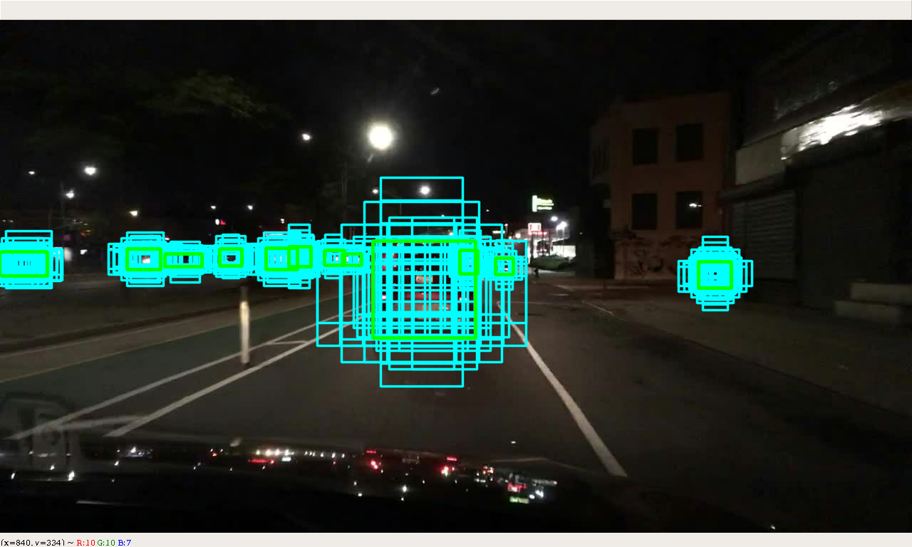

# bayes-od-rc (Alpha 1.0)
Tensorflow 2.0 Code to reproduce results of the paper: [BayesOD: A Bayesian Approach for Uncertainty Estimation in Deep Object Detectors](https://arxiv.org/abs/1903.03838) 

"Alpha" means there may be many bugs, config format may change, tensorflow2.0 API may change, etc...

Tested on python 3.6, tensorflow 2.0, and ubuntu 18.04 ONLY.

# News:
2020-03-04: I will be deprecating this repository in the months to come in favor of a pytorch implementation. The new implementation will include
much more features and network architectures and will provide COCO and PASCAL dataset implementations.

2020-03-04: Fixed deprecated function in tf-probability.

2019-11-16: BayesOD V1.0 initial released.

# Install:
I recommend to use a virtual environment to install the requirements. In the future, I might provide a Docker container 
for easier installation.

#### 1.0 Clone Code:
./ means the location where the repo was cloned.

    git clone https://github.com/asharakeh/bayes-od-rc.git
    
    add2virtualenv ./bayes-od-rc
    
    cd ./bayes-od-rc
    
    pip install -r requirments.txt

#### 2.0 Download Datasets:
Please follow the provided folder structure for both datasets. This should be the default structure once the datasets 
are extracted.

 2.1 Download the Berkeley Deep Drive (BDD) Object Detection Dataset [here](https://bdd-data.berkeley.edu/).  
 
     └── BDD_DATASET_ROOT
         ├── info
         |   └── 100k
         |       ├── train
         |       └── val
         ├── labels
         └── images
                ├── 10K
                └── 100K
                    ├── test
                    ├── train
                    └── val
                   
 2.2 Download the KITTI Object Detection Dataset [here](http://www.cvlibs.net/datasets/kitti/eval_object.php).
     
    └── KITTI_DATASET_ROOT
        ├── object
            ├── training    <-- 7481 train data
            |   ├── image_2
            |   ├── calib
            |   └── label_2
            └── testing     <-- 7580 test data
                   ├── image_2
                   └── calib
 
Make sure that the .yaml config files in `./bayes-od-rc/srec/retina_net/configs` point to the correct dataset folders.

    # Dataset Specific Configs
    bdd:
        paths_config:
            dataset_dir: '~/Datasets/bdd100k'
    
    kitti:
        paths_config:
            dataset_dir: '~/Datasets/Kitti/object'

### 3.0 Initial Test: 
As an initial test run:

    python ./bayes-od-rc/demos/retina_net/anchor_generation_demo.py

The output should be RetinaNet's anchors, similar to the following image: 

# Training, Validation and Inference
### 4.0 Training RetinaNet on the BDD dataset:
Two configuration files are given to train on BDD dataset.  
`retinanet_bdd.yaml` performs training with the loss function from
[Kendall et. al.](https://papers.nips.cc/paper/7141-what-uncertainties-do-we-need-in-bayesian-deep-learning-for-computer-vision)

`retinanet_bdd_covar.yaml` performs training with the loss function from our paper and allows the estimation of the full covariance matrix.

To run training use the following command:

    python ./bayes-od-rc/src/retina_net/experiments/run_training.py --yaml_path=PATH_TO_CONFIG --gpu_device=WHICH_GPU

Training should create a folder `./bayes-od-rc/data/outputs` which contains the main experiment folder. The experiment folder contains all saved checkpoints
as well as a logs folder. The logs folder can be used to launch tensorboard according to:
`tensorboard --logdir=logs`

To run validation use the following command:

    python ./bayes-od/src/retina_net/experiments/run_validation.py --yaml_path=PATH_TO_CONFIG --gpu_device=WHICH_GPU

Validation could be run on a second GPU in parallel, or after 
training ends. It is used to plot validation losses Tensorboard. The validation script does not run BayesOD and should NOT
be used for inference.

### 5.0 Running Neural Network Inference and BayesOD:
To run inference using BayesOD, use the following command:
    
    python ./bayes-od/src/retina_net/experiments/run_inference.py --yaml_path=PATH_TO_CONFIG --gpu_device=WHICH_GPU

Inference runs on the validation set of the BDD dataset. To run on the validation set of KITTI, change 
  
    # Testing Configuration
    testing_config:
        test_dataset: 'bdd'
        
To the following in the config file:

    # Testing Configuration
    testing_config:
        test_dataset: 'kitti'
        
Inference does not require any ground truth and could easily be extended to test on custom datasets.

### 6.0 Evaluation:
I provide code in `./bayes-od/src/retina_net/offline_eval` to perform evaluation using MUE, AP and PDQ on both the KITTI and BDD datasets.

### 7.0 Frequently Asked Questions:
##### Where are the COCO and PASCAL VOC datasets?
COCO and PASCAL VOC requires special instructions for training, inference and evaluation. I will need to find time to either make the process more mainstream 
or write a proper Readme before I can release the dataset handler and config files for those. If I get a lot of requests for COCO, I will make sure to hasten 
the release.

# Acknowledgements:

traveller59's [second.pytorch](https://github.com/traveller59/second.pytorch) repository for inspiring my repo's structure.  
fizyr's [keras_retinanet](https://github.com/fizyr/keras-retinanet) repository for helping me better understand the details of the coco dataset.
